# 🎬 Proyecto de Simulación de Cine Planet

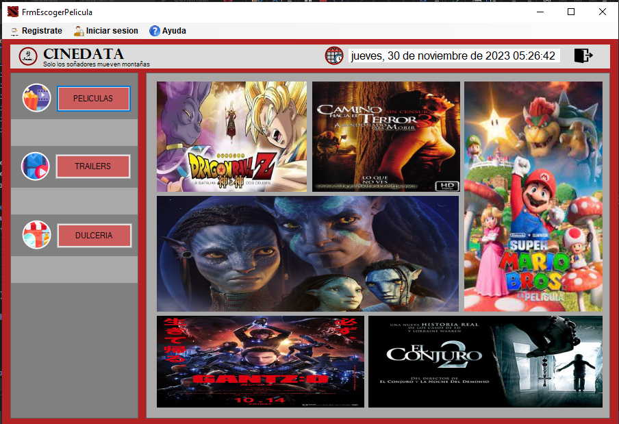

---

## 📝 Descripción del Proyecto

Este proyecto fue desarrollado como **proyecto final del instituto**.  
Nuestro objetivo principal fue **ir más allá de un simple CRUD**, tomando como referencia el flujo real del sistema de **Cine Planet** para mejorar nuestra **lógica, diseño e investigación de nuevas tecnologías**.

Inicialmente fue desarrollado en **Java (versión escritorio)**, pero luego decidimos **rehacerlo completamente en C# con Visual Studio**, logrando un resultado más sólido y funcional.

> 📍 Proyecto realizado en el **3er ciclo del Instituto**.

---

## ⚙️ Tecnologías Utilizadas

### 🧰 Lenguajes, Herramientas y Entorno

  
  
  
  
  
  

- 💻 **Lenguaje:** C#
- 🧩 **Entorno de desarrollo:** Visual Studio
- 🗄️ **Base de Datos:** SQL Server
- 🎨 **Interfaz Gráfica:** Windows Forms
- 🧠 **Arquitectura:** MVC (Modelo - Vista - Controlador)
- 🔧 **Control de versiones:** Git / GitHub

---

## 🎯 Objetivo

Simular el **flujo real de compra en Cine Planet**, desde el registro de cliente hasta la selección de película, butacas, dulcería y métodos de pago, con un enfoque administrativo completo.

---

## 🚀 Funcionalidades Principales

### 👥 Módulo Cliente

- 🔐 **Login de clientes**
- 📝 **Registro de nuevos clientes**
- 🎥 **Visualización de películas y tráilers**
- 🎟️ **Selección de entradas y tipos de entrada**
- 🍿 **Selección de dulcería (combos y productos)**
- 💳 **Elección de tipo de pago**
- 💺 **Inhabilitación automática de butacas compradas**
- 🧾 **Reporte final con resumen de compra:**
  - Nombre
  - Correo
  - Película
  - Butacas
  - Entradas
  - Dulcería
  - Tipo de pago
  - Precio total

---

### 🧑‍💼 Módulo Administrativo

- 🔐 **Login de administradores**
- 👨‍💼 **CRUD de empleados**
- 🧑‍💻 **CRUD de administradores**
- 🎬 **Actualización de información de películas (nombre, tráiler, imagen)**
- 💺 **Reactivación masiva de todas las butacas**
- 📊 **Reporte general de empleados**

---

## 🌟 Funcionalidades Extras del Sistema

### 🎞️ Parte del Tráiler

Dependiendo de la película seleccionada, se muestra un **tráiler específico**.  
Cada selección abre un nuevo formulario mostrando las **butacas disponibles**.

### 💺 Parte de Selección de Butacas

El usuario puede seleccionar varias butacas (por ejemplo, 5).  
El sistema valida que el número de entradas coincida con la cantidad de butacas seleccionadas para continuar.

### 🍫 Parte de Dulcerías

El cliente puede escoger **cualquier combo o producto**, además de **elegir cantidades personalizadas**.

### 💰 Parte de Pago

Disponibilidad para seleccionar **diferentes métodos de pago** (efectivo, tarjeta, etc.).

### 🧾 Resumen Final

Al finalizar, se genera un **reporte detallado** con todos los datos del pedido y se **guarda automáticamente en la base de datos**.  
Al volver a abrir la aplicación, las **butacas ya ocupadas aparecen inhabilitadas.**

---

## 📹 Video de Ejecución del Proyecto

🎬 **Ver demostración completa:**  
👉 [https://www.youtube.com/watch?v=TJgZAAkznqA&t=262s](https://www.youtube.com/watch?v=TJgZAAkznqA&t=262s)

---

## 🖼️ Capturas del Proyecto

| Pantalla                      | Vista                                |
| ----------------------------- | ------------------------------------ |
| 🏠 **Inicio de sesión**       | 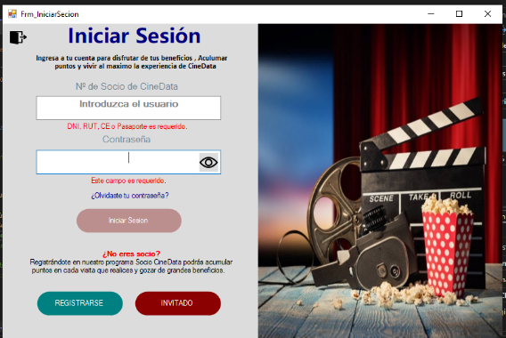    |
| 🎥 **Cartelera de Películas** |      |
| 🎥 **Trailer**                | 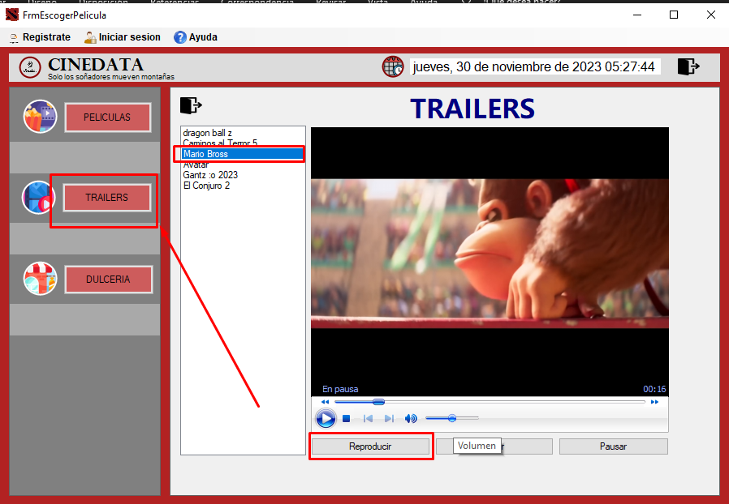   |
| 💺 **Selección de Butacas**   | 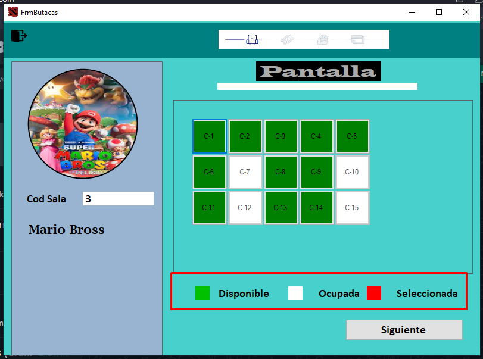   |
| 🍿 **Módulo de Dulcería**     | 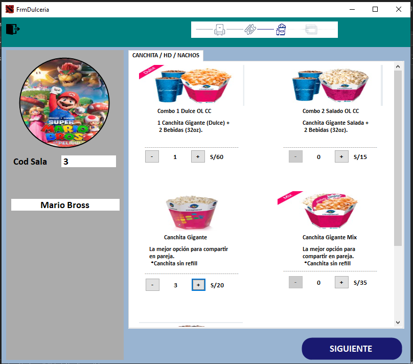 |
| 💳 **Métodos de Pago**        | 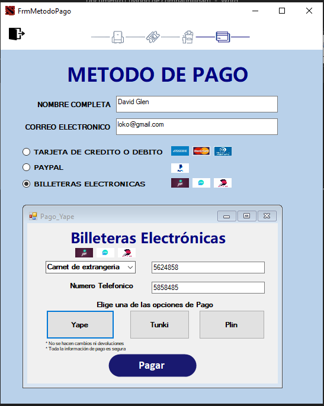   |
| 📊 **Reporte Final**          | 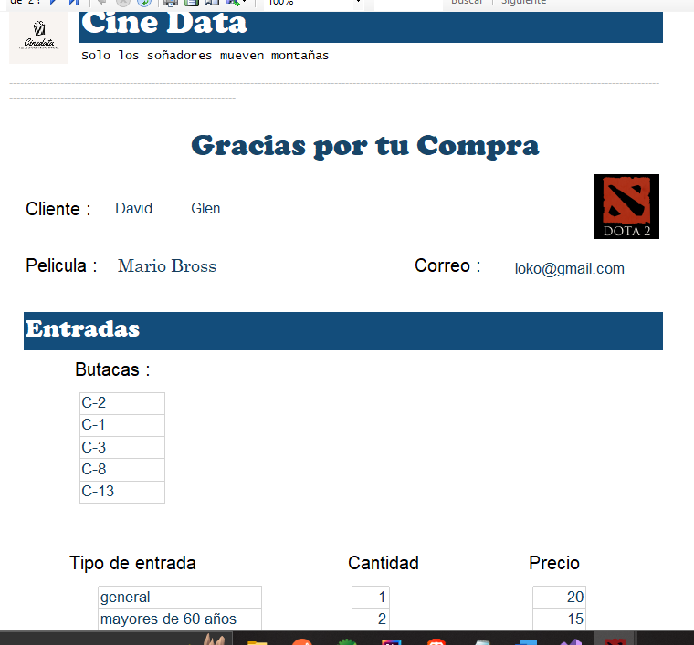   |
| 📊 **Reporte Final**          | 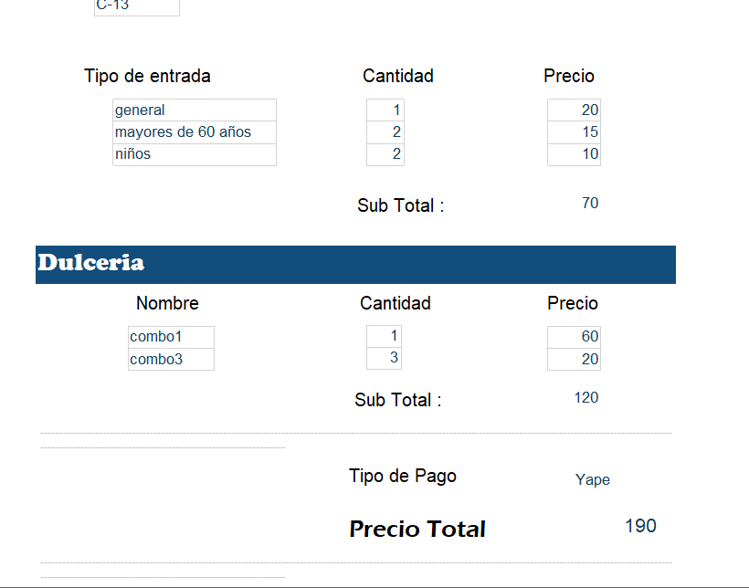  |
| 📊 **SQL**                    | 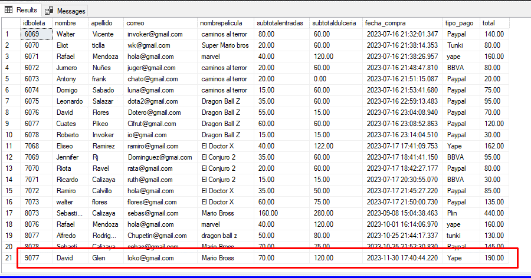           |

---

---

## 📸 **Galería Visual**

 
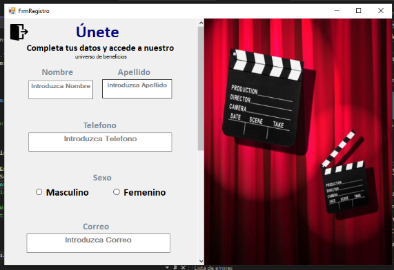 
 
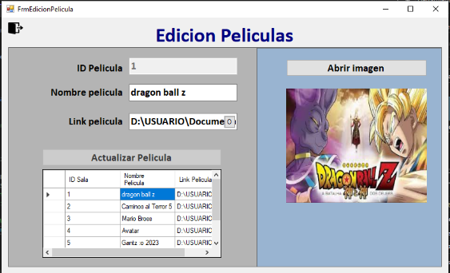 
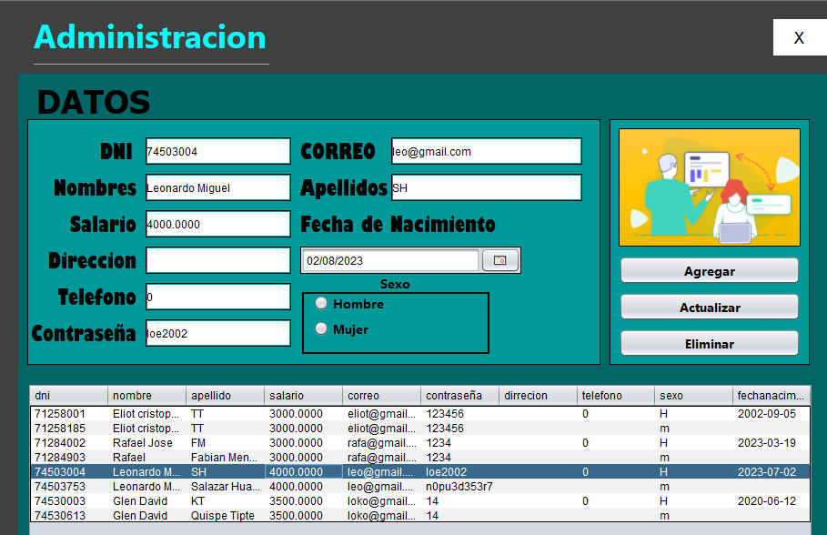 
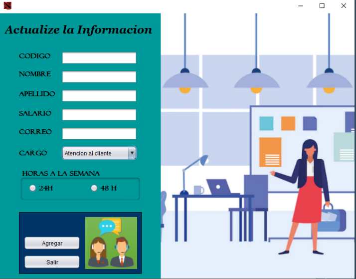

---

## 💡 Lecciones Aprendidas

- Mejor comprensión del **flujo de sistemas reales** como Cine Planet.
- Aprendizaje sobre **validaciones complejas y estados de butacas**.
- Integración de **múltiples formularios y entidades conectadas**.
- Refuerzo en **diseño, lógica de programación y estructura MVC**.

---

---

## ✨ Estado del Proyecto

✅ **Completado**  
📅 **Versión final presentada al instituto**

## 👨‍💻 **Autor**

**Desarrollado por Glen David** | [Loko0055x](https://github.com/loko0055x)

---

## 🪪 **Licencia**

Este proyecto fue creado como proyecto final de insituto
